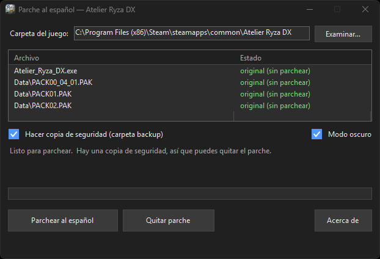
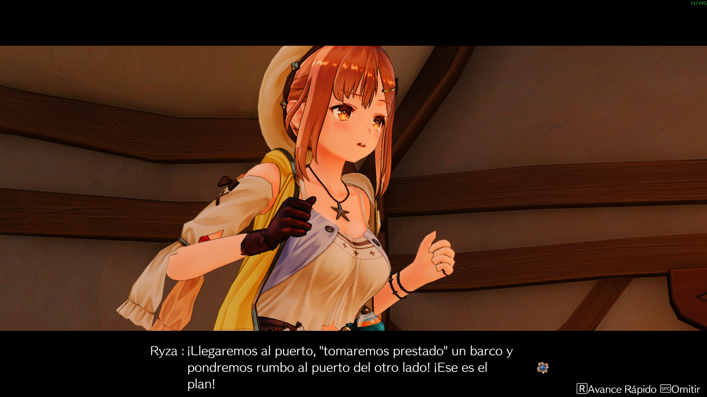
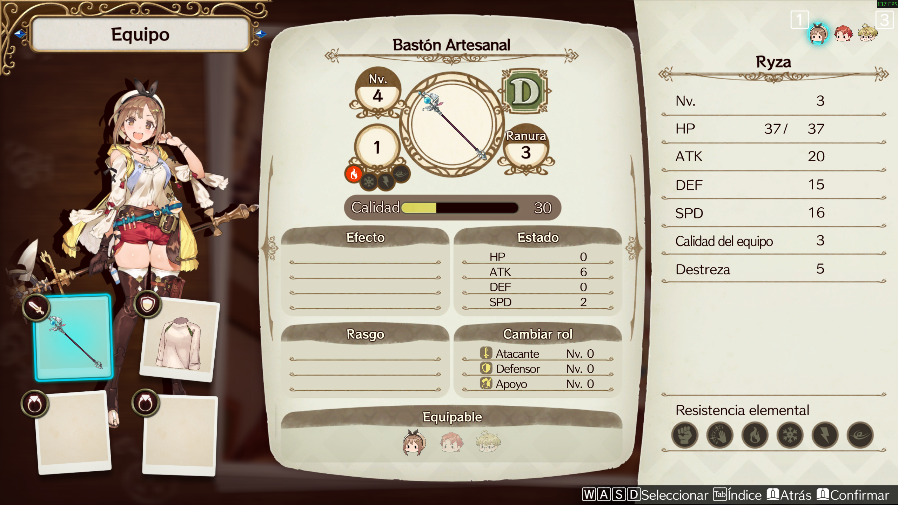
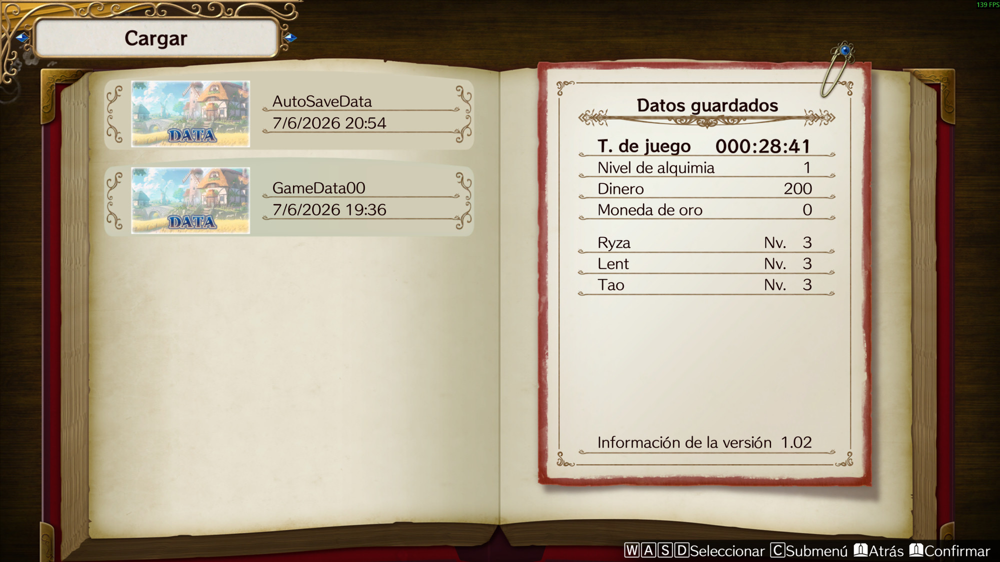

<p align="center">
  <em>Este parche es un proyecto de fans, hecho en el tiempo libre y publicado <strong>gratis</strong>.
  Detrás hay miles de líneas traducidas y mucho trabajo para que Ryza se pueda disfrutar en español.
  Si te ha servido y quieres que sigan saliendo proyectos como este, puedes apoyarlo con una
  donación: por pequeña que sea, marca la diferencia y anima a seguir.</em>
</p>

<p align="center">
  <a href="https://www.paypal.com/donate/?hosted_button_id=LQDFW67ZG2DKQ">
    
  </a>
</p>

---

# Atelier Ryza DX — Parche al español

Programa que traduce al **español** tu copia de *Atelier Ryza: Ever Darkness & the Secret
Hideout DX*. Eliges la carpeta del juego, pulsas un botón y listo. También puede quitar el
parche y dejar el juego como estaba.

> ⚠️ **Solo funciona con la versión `1.0.0.2` del juego** (la que aparece como *"Ver. 1.02"* en
> la pantalla de título). Con otra versión el programa te avisará y no tocará nada.

> El juego no tiene español. La traducción se instala sobre el idioma **inglés**: se traduce el
> contenido de las carpetas `*_en` manteniendo el nombre, y se juega con el idioma puesto en
> **English**.

---

## Cómo parchear el juego

<p align="center">
  
</p>

1. **Descarga el archivo `RyzaDX-ParcheES.exe`** de la sección
   [**Releases**](../../releases/latest) y ábrelo. Es un único archivo, no hace falta instalar nada.
2. **Comprueba la carpeta del juego.** El programa suele detectarla solo. Si no, pulsa
   *Examinar…* y elige la carpeta donde está `Atelier_Ryza_DX.exe`.
3. **Deja marcada la casilla de copia de seguridad.** Guarda los archivos originales en una
   carpeta `backup` dentro del juego, y es lo que permite deshacer el parche después.
4. **Pulsa *Parchear al español*** y espera a que termine la barra de progreso. Si el juego está
   en `Archivos de programa`, te pedirá reiniciarse como administrador: dile que sí.
5. **Abre el juego y pon el idioma en English.** La traducción está dentro de los archivos del
   idioma inglés, así que con el juego en inglés verás el español.

Si el botón *Parchear al español* aparece en gris, el propio programa te dice el motivo justo
debajo: que la carpeta no es la del juego, que ya está parcheado, o que tienes otra versión.

### Quitar el parche

Abre el programa, elige la misma carpeta y pulsa *Quitar parche*. El botón solo está disponible
si hiciste la copia de seguridad. Si no la hiciste, puedes dejar el juego como estaba con
**"Verificar la integridad de los archivos del juego"** en Steam.

Cuando ya no la necesites, puedes borrar la carpeta `backup` para recuperar unos 790 MB.

---

## Qué está traducido

| | |
|---|---|
| Diálogos, historia y eventos | ✅ Traducido |
| Objetos, recetas, misiones, menús, interfaz y mensajes del sistema | ✅ Traducido |
| Acentos y signos (`á é í ó ú ü ñ ¿ ¡`) | ✅ Se ven correctamente |
| Imágenes de menús y títulos | ✅ Traducidas, pero **no en 4K** (a resolución alta se ven algo menos nítidas) |
| Imágenes de los tutoriales | ❌ Siguen en inglés |

**Sobre la traducción del texto:** está hecha con inteligencia artificial y **revisada** después.
Puede que se escape alguna expresión mejorable; si ves algo raro, se agradece el aviso.

### Fallos conocidos

- **Textos de las pantallas de carga**: salen en **inglés** y con algún carácter cambiado (por
  ejemplo `ulease wait...` en vez de `please wait...`). Usan una fuente distinta a la del resto
  del juego. No afecta a la jugabilidad.

---

## Capturas

| | |
|:---:|:---:|
|  |  |
|  |  |
|  |  |

---

## Compilar

Con el [SDK de .NET 9](https://dotnet.microsoft.com/download):

```bash
dotnet publish src/RyzaEsPatcher.App -c Release
```

El ejecutable queda en la carpeta `out/`.

---

## Créditos

- Las **imágenes de menús ya traducidas** se obtuvieron de la
  [traducción al español de Atelier Ryza (A21)](https://steamcommunity.com/sharedfiles/filedetails/?id=2892108696).
  ¡Gracias!
- Motor de parcheo: [HDiffPatch](https://github.com/sisong/HDiffPatch), de housisong (licencia MIT).

## Aviso legal

Proyecto de fans, sin ánimo de lucro. **No incluye ningún archivo del juego**: el programa
aplica las diferencias sobre los archivos de tu propia copia, que debe ser legal. No está
afiliado ni respaldado por Koei Tecmo ni por Gust; el juego y todos sus contenidos pertenecen a
sus respectivos propietarios.

El código de este programa se publica bajo licencia [MIT](LICENSE).
